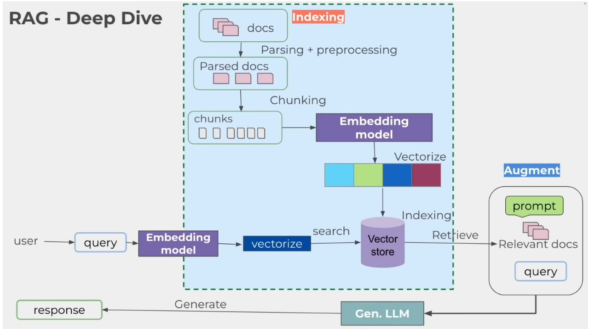

# Retrieval-Augmented Generation (RAG)



*Source: [freecodecamp](https://www.youtube.com/watch?v=GWB9ApTPTv4&t=403s)*


## Overview
This project presents a basic [Retrieval-Augmented Generation (RAG)](https://aws.amazon.com/what-is/retrieval-augmented-generation/) system that integrates [**Llama3.2**](https://ai.meta.com/blog/llama-3-2-connect-2024-vision-edge-mobile-devices/) for local LLM deployment, [**nomic-embed-text**](https://ollama.com/library/nomic-embed-text) for precise text embeddings, and vector search techniques to optimize document-based question answering.


## Prerequisites
1. **Download and install Ollama:**
   ```bash
   curl -fsSL https://ollama.ai/install.sh | sh  # Linux/macOS
   winget install Ollama.Ollama  # Windows
   ```
   Or you can download from [Ollama](https://ollama.com/download) official website.
   
2. **Pull the Llama3.2 model:**
   ```bash
   ollama pull llama3.2
   ```
3. **Pull the nomic-embed-text model:**
   ```bash
   ollama pull nomic-embed-text
   ```
4. **Start the Ollama server:**
   ```bash
   ollama serve
   ```

## Technology Stack
- **Python**
- **[FastAPI](https://fastapi.tiangolo.com/)** - API development
- **[LangChain](https://www.langchain.com/)** - RAG implementation
- **[Ollama](https://ollama.com/)** - Local LLM deployment (using Llama3.2)
- **[ChromaDB](https://docs.trychroma.com/docs/overview/introduction)** - Vector store

## Core Features
### RAG System Implementation
1. **Document Ingestion Pipeline**
   - Processes **PDF** files
   - Generates embeddings for document chunks
   - Stores embeddings in **ChromaDB**
2. **Query Pipeline**
   - Retrieves relevant context based on user questions
   - Constructs appropriate prompts for the LLM
   - Returns answers with **source citations**

### API Development
- **Endpoints:**
  - Document upload and ingestion
  - Question answering with context
- **Monitoring Features:**
  - Number of tokens used
  - Response times

### Additional Features
- **Basic result caching**
- **Swagger documentation**
- **Basic authentication**

## System Architecture
1. User uploads documents (PDF)
2. System processes and extracts text
3. Text is chunked and embeddings are stored in **ChromaDB** using **nomic-embed-text** for text embedding
4. User submits a query
5. System retrieves relevant context using vector search
6. LLM (**Llama3.2 3B parameters**, via **Ollama**) generates a response with citations

## Setup Instructions
1. Clone the repository:
   ```bash
   git clone https://github.com/syahrulazka/project-rag.git
   cd project-rag
   ```
2. Create a virtual environment and install dependencies:
   - **For macOS/Linux:**
     ```bash
     python3 -m venv venv
     source venv/bin/activate
     ```
   - **For Windows:**
     ```powershell
     python -m venv venv
     venv\Scripts\activate
     ```
   - Install dependencies:
     ```bash
     pip install -r requirements.txt
     ```
3. Create a `.env` file with the following content:
   ```ini
   API_KEY=yourapikey
   UPLOAD_DIR=./data/upload
   CHROMA_DB_DIR=./data/chroma_db
   ```
4. Start the FastAPI server:
   ```bash
   uvicorn app.main:app --host 0.0.0.0 --port 8000 --reload
   ```
5. Access API documentation at:
   ```
   http://127.0.0.1:8000/docs
   ```

## API Usage Examples
### Upload a PDF Document
**Parameters:**
- `file`: PDF file to be uploaded.
- `X-API-Key`: API key for authentication.

**cURL Request:**
```bash
curl -X 'POST' \
  'http://localhost:8000/upload-pdf/' \
  -H 'accept: application/json' \
  -H 'X-API-Key: yourapikey' \
  -H 'Content-Type: multipart/form-data' \
  -F 'file=@yourdocument.pdf;type=application/pdf'
```

### Ask a Question
**Parameters:**
- `query`: Questions to ask.
- `X-API-Key`: API key for authentication.

**cURL Request:**
```bash
curl -X 'POST' \
  'http://localhost:8000/ask/' \
  -H 'accept: application/json' \
  -H 'X-API-Key: yourapikey' \
  -H 'Content-Type: application/json' \
  -d '{"query": "What is the best way to start a new habit?"}'
```

## Explanation of RAG Implementation Choices
- **LangChain**: Provides seamless document parsing and embedding generation
- **Ollama**: Enables efficient local deployment of Llama3.2 for cost-effective and private inference
- **ChromaDB**: Offers a lightweight and fast vector store for similarity search
- **FastAPI**: Ensures high-performance API interactions with built-in documentation support

## Future Improvements
- Implement **streaming responses** for real-time user interactions
- Add **support for more document formats** (e.g., Word, HTML)
- Develop a **web-based UI** for seamless user interaction

---
Made by Syahrul Azka

